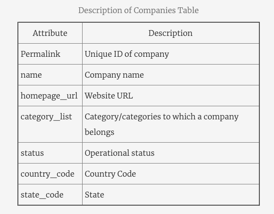
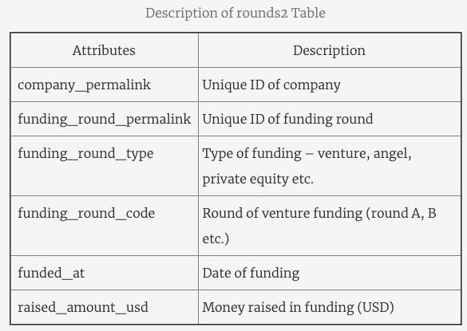

# Investment Analysis

## Business and Data Understanding

Spark Funds has two minor constraints for investments:

It wants to invest between 5 to 15 million USD per round of investment

It wants to invest only in English-speaking countries because of the ease of communication with the companies it would invest in.

For the analysis, consider a country to be English speaking only if English is one of the official languages in that country

These conditions will give us sufficient information for the initial analysis. Before getting to specific questions, let’s understand the problem and the data first.

1. What is the strategy?

Spark Funds wants to invest where most other investors are investing. This pattern is often observed among early stage startup investors.

2. Where is the data from?

It is a real investment data from crunchbase.com, so the insights we get may be incredibly useful.

3. What is Spark Funds’ business objective?

The business objectives and goals of data analysis are pretty straightforward.

### Business objective:
The objective is to identify the best sectors, countries, and a suitable investment type for making investments. The overall strategy is to invest where others are investing, implying that the 'best' sectors and countries are the ones 'where most investors are investing'.

### Goals of data analysis:
The goals are divided into three sub-goals:

#### Investment type analysis:
Comparing the typical investment amounts in the venture, seed, angel, private equity etc. so that Spark Funds can choose the type that is best suited for their strategy.
#### Country analysis:
Identifying the countries which have been the most heavily invested in the past. These will be Spark Funds’ favourites as well.
#### Sector analysis:
Understanding the distribution of investments across the eight main sectors.
(Note that we are interested in the eight 'main sectors' provided in the mapping file. The two files — companies and rounds2 — have numerous sub-sector names; hence, we will need to map each sub-sector to its main sector.)

## Attributes Definition

